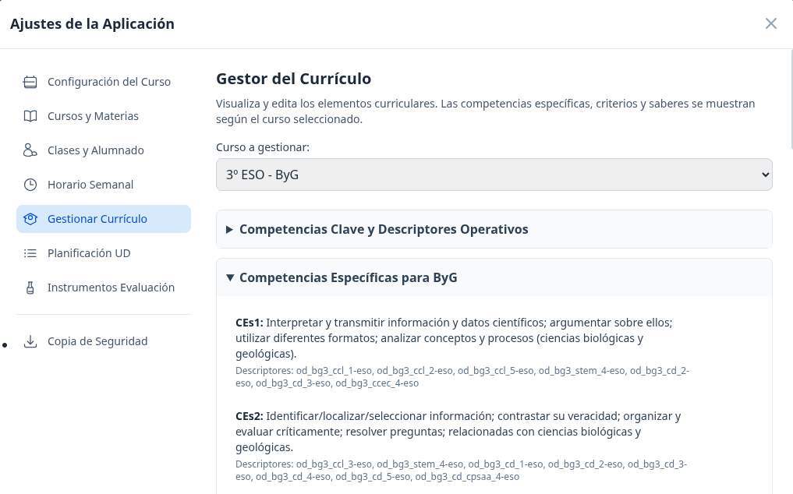
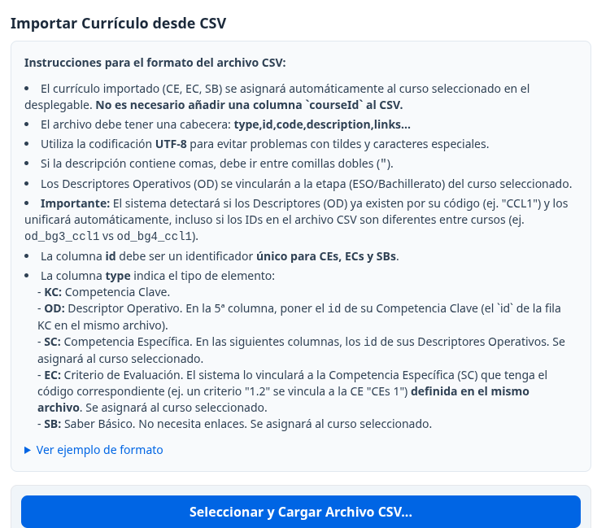
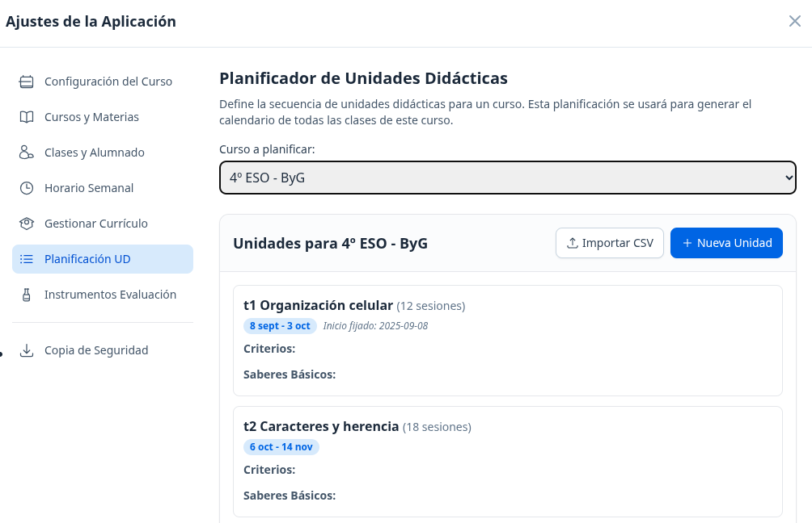
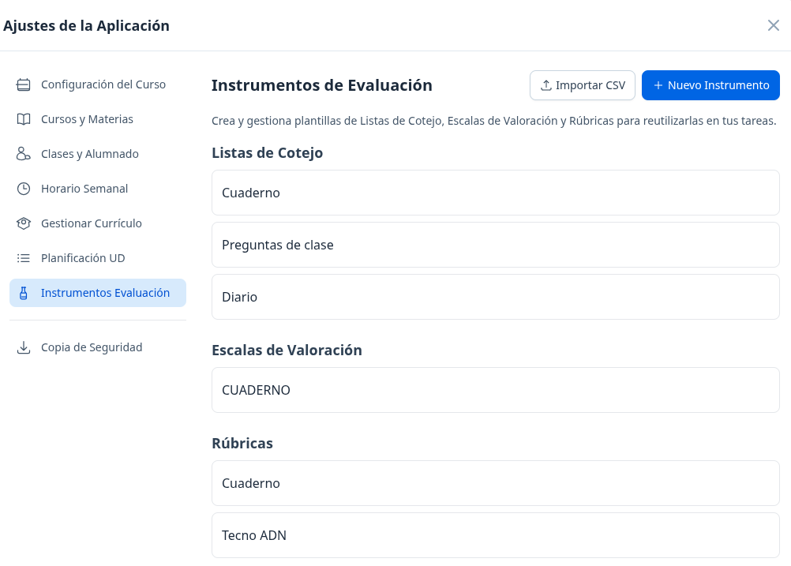
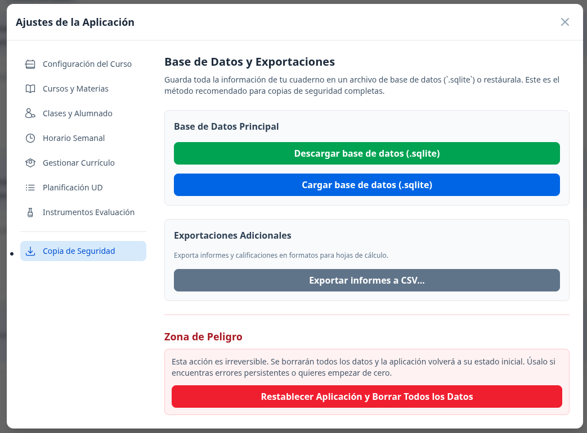

# Cuaderno del Profesorado

**¡Bienvenido a su cuaderno digital personal!**

Este proyecto es una **aplicación local** diseñada para que el docente tenga el **control absoluto** sobre su gestión académica. 

**¿Por qué es diferente?** A diferencia de las soluciones en la nube, aquí **usted es el propietario real de sus datos**. 

**La base de datos se almacena exclusivamente en su ordenador.** Esto garantiza la privacidad de la información del alumnado y el cumplimiento de la normativa de protección de datos, ya que **nada sale de su equipo**.

> **💾 Nota sobre la persistencia**  
> Los datos se guardan en el almacenamiento local de su equipo vinculado al navegador. Siempre que acceda desde el **mismo ordenador y con el mismo navegador**, sus datos estarán ahí. No es necesario realizar descargas de seguridad diarias para continuar su trabajo, aunque se recomienda hacer **copias de la carpeta del proyecto periódicamente**.

## 📱 Vista previa de la aplicación

### 📅 **Calendario**
  

### 📓 **Cuaderno**
  

### 📄 **Diario de clase**


### ⚙️ **Ajustes**
          

**→ [Ver todas las capturas (20+ imágenes)](screenshot/)**

# 🚀 Instalación Paso a Paso

## 📥 1. Descarga del proyecto (TODOS los sistemas)

1. Pulse **"Code"** (verde) → **"Download ZIP"**
2. Ubíque el zip en la carpeta donde vaya a utilizarlo en adelante.
3. Descomprima y **recuerde la carpeta**

---

## 🖥️ **WINDOWS**

### **Instalar Node.js:**
1. Vaya a [nodejs.org](https://nodejs.org/) y descargue la versión que dice **LTS** (es la más estable).
2. Ejecute el archivo descargado y pulse Siguiente en todas las ventanas hasta finalizar.

### **Abrir terminal en carpeta:**
Para que la aplicación funcione, la consola debe "estar" dentro de la carpeta del cuaderno:

1. Abra la carpeta donde descomprimió el proyecto.
2. En la parte superior de la ventana (en la barra de direcciones donde aparece la ruta de la carpeta), haga clic en un espacio vacío, escriba la palabra `cmd` y pulse **Intro**.
3. Se abrirá una ventana negra. Si ve que la ruta que aparece escrita coincide con la ubicación de su carpeta, lo ha hecho correctamente.

### **Instalación y arranque:**
1. En esa ventana negra, escriba el siguiente comando y pulse Intro:
   ```
   npm install
   ```
2. Espere a que terminen de aparecer líneas de texto. Una vez que se detenga, escriba:
   ```
   npm run dev
   ```

---

## 🍎 **macOS**

### **Instalar Node.js:**
1. Vaya a [nodejs.org](https://nodejs.org/) y descargue la versión que dice **LTS** (es la más estable).
2. Ejecute el archivo descargado y pulse Siguiente en todas las ventanas hasta finalizar.

### **Abrir terminal en carpeta:**
1. Busque su carpeta del cuaderno en el **Finder**.
2. Haga clic derecho sobre la carpeta del cuaderno.
3. Seleccione **Nuevo terminal en la carpeta** (o "Servicios" > "Nuevo terminal en la carpeta").
4. Se abrirá una ventana blanca o negra. Verá el nombre de su carpeta justo antes del cursor.

### **Instalación y arranque:**
1. En el terminal, escriba este comando y pulse Intro:
   ```
   npm install
   ```
2. Cuando finalice el proceso, escriba el comando de arranque:
   ```
   npm run dev
   ```

---

## 🐧 **LINUX**

### **Instalar Node.js:**
```
sudo apt update && sudo apt install nodejs npm
```

### **Abrir terminal en carpeta:**
1. Localice la carpeta descomprimida.
2. Haga clic derecho en un espacio vacío dentro de esa carpeta y seleccione **Abrir en una terminal**.

### **Instalación y arranque:**
1. En el terminal, escriba este comando y pulse Intro:
   ```
   npm install
   ```
2. Cuando finalice el proceso, escriba el comando de arranque:
   ```
   npm run dev
   ```

---

## 🌐 Acceder: 

Una vez que haya ejecutado el comando `npm run dev`, fíjese en los mensajes que aparecen en la consola. Verá una línea similar a esta:

`> Local: http://localhost:3000/`

El número (3000, 3001, etc.) es el **puerto**. Aunque normalmente es el 3000, si ese está ocupado, el sistema abrirá otro automáticamente.

1. No cierre la ventana de la consola (si la cierra, la aplicación dejará de funcionar).
2. Abra su navegador (Chrome, Firefox, etc.).
3. En la barra de direcciones superior, escriba la dirección que le indicó la consola (normalmente `http://localhost:3000/`) y pulse Intro.

**¡Ya puede empezar a usar su Cuaderno del Profesorado!**
---

## 📖 [Manual de Usuario →](MANUAL_USUARIO.md) *en proceso*


## 🔒 Sobre la seguridad de los datos

- ✅ **100% local** - Nada sale de su ordenador
- ✅ **Sin cuentas ni registros** - No necesita registrarse
- ✅ **Compatible con RGPD** - Cumple normativa de protección de datos
- ✅ **Copia de seguridad sencilla** - Copie la carpeta completa

**¡Gracias por confiar en Cuaderno del Profesorado!**
